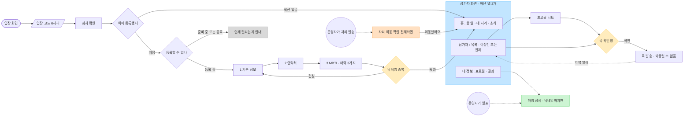
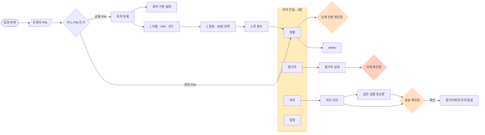
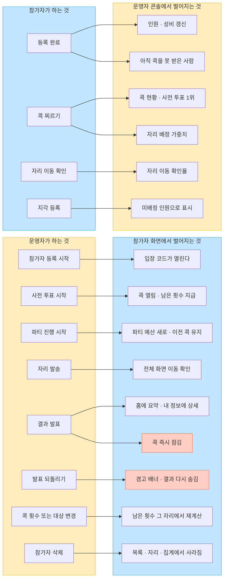
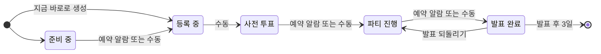
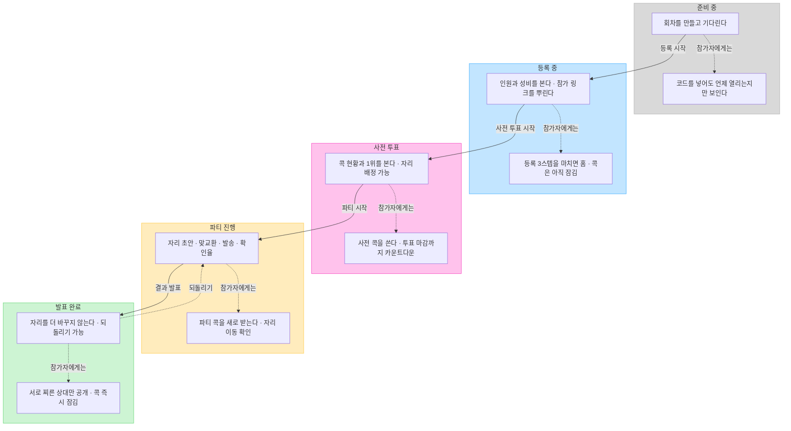
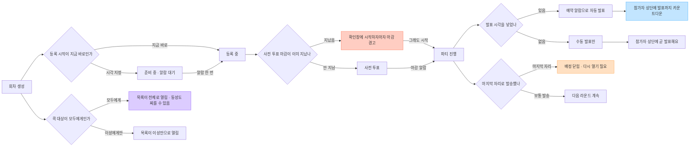

# 사용자 플로우

GitHub 에서 그대로 그려진다. 화면을 바꾸면 **여기도 같이 고친다** — 안 고치면
다음에 이 그림을 근거로 틀린 판단을 하게 된다. (실제로 `FLOWS.md` 가 한 번 뒤처졌다)

| 그림 | 답하는 질문 |
|---|---|
| [1 참가자](#1-참가자-플로우) | 참가자가 어느 화면을 거치나 |
| [2 운영자](#2-운영자-플로우) | 운영자가 어느 화면을 거치나 |
| [3 상호 영향](#3-상호-영향) | 한쪽 행동이 반대쪽에 어떻게 나타나나 |
| [4 회차 단계](#4-회차-단계) | 회차가 어떤 상태를 지나나 |
| [5 단계별 양쪽](#5-단계별로-양쪽이-무엇을-하나) | 각 단계에서 둘이 각각 뭘 하나 |
| [6 설정 분기](#6-설정이-만드는-분기) | 운영자 설정이 단계와 화면을 어떻게 바꾸나 |

---

## 1 참가자 플로우

- 참가 링크(`/j/:code`)를 다시 열면 **이미 등록한 사람인지 먼저 본다.** 등록 화면이 또 나오면
  "내가 등록이 안 됐나" 하고 두 번 등록하려 든다
- 홈이 스택의 바닥이다. 어느 탭에 있든 뒤로 가기 한 번이면 홈 (`ROUTES.md`)
- 자리 이동 확인은 **발표가 끝났으면 띄우지 않는다**

## 2 운영자 플로우

- 회차 PIN 으로 들어오면 **그 회차 콘솔로 바로** 간다. 회차 목록·기본 설정·회차 생성은 공통 PIN 전용
- 자리 초안은 확인 없이 몇 번이든 다시 만든다. **발송에만** 확인이 붙는다 (ADR-6)
- 좌석 변경은 **맞교환 하나뿐**이다. 한 명만 옮기면 테이블 성비가 깨진다

## 3 상호 영향

참가자 화면은 실시간(WS)으로 **"다시 읽어라"** 신호만 받고 서버에서 한 벌을 다시 가져온다.
부분 갱신을 만들면 화면과 서버가 조용히 어긋난다.

## 4 회차 단계

**예약은 한 번만 울리는 알람이다** (ADR-2). 실제 전환 시각을 `fired` 에 남기고, 알람은 `fired` 가
비어 있을 때만 울린다. 그래서 되돌리기를 해도 즉시 다시 앞으로 밀리지 않는다.
예약 값 자체는 지우지 않는다 — "예약은 21:00 이었는데 20:45 에 진행했다"를 보여줘야 하기 때문.

## 5 단계별로 양쪽이 무엇을 하나

## 6 설정이 만드는 분기

- **발표 시각은 회차 설정에서만** 넣을 수 있다. 생성 위저드는 등록 시작·투표 마감 둘만 받는다
- 마지막 자리라는 사실은 **참가자에게 알리지 않는다.** 운영자에게만 배정이 닫힌다
- 동성 콕을 열어도 **자리 배정의 남녀 정원은 그대로다.** 콕은 가중치로만 들어간다
